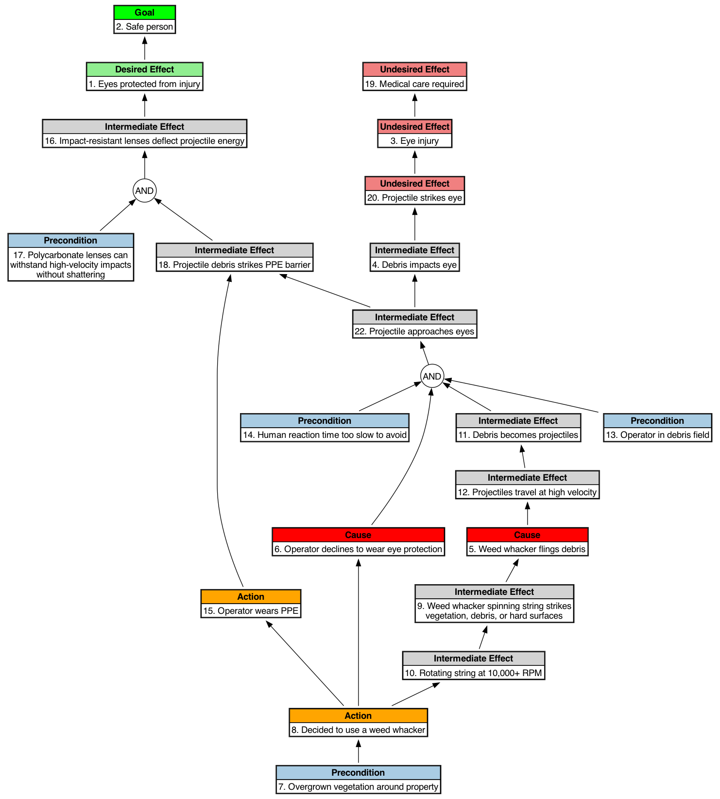
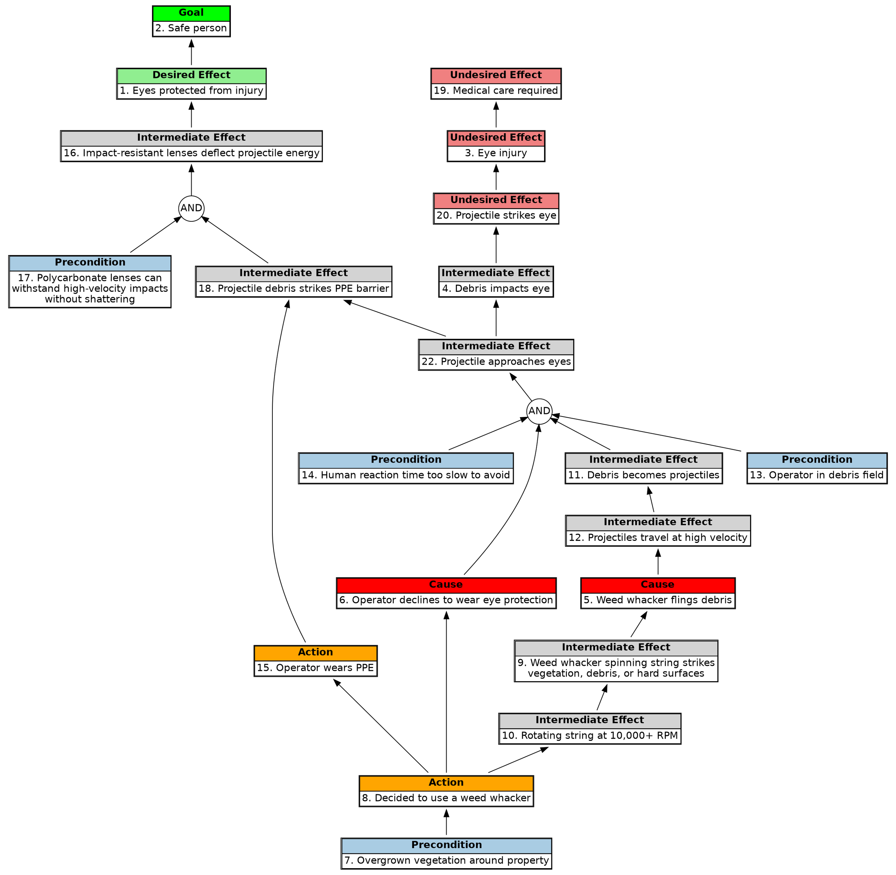

# Readme

## Description

### What is it?
A shortened causal language, inspired by graphviz, and Theory of Constraints Reality Tree.

### Rationale
I like graphviz, but I got frustrated with its inability to add a type in the rectangle like UML tools can do.

So I built the graphviz by hand to show what I wanted, but then found that trying to add that much formatting interrupted the flow of thinking when doing causal analysis.

So python to the rescue to handle the boring stuff, and now I can create causal analysis in the Theory of Constraints Reality Tree format (mostly). The ellipse for `AND` is just a circle, but it's close enough for better discussions with people.

Start with a clear project title, brief one-line description, and a more detailed explanation of what the application does and why it exists. Include badges for build status, version, license, and Python version compatibility.

## Installation Instructions

### Dependencies
I'm using Python 3.13.3.

* For MacOS, run `brew install python` from terminal.
  - Verify installation by running `python3 --version` in terminal.

You need [graphviz](https://graphviz.org/) already on your system for this script to work.

* For MacOS, use `brew install graphviz`

I used python3 with no additional [pypi](https://pypi.org/) libraries.

I have not published this to pypi yet.


### Usage Example
I included a toy example of a causation analysis so you can see the context of usage. I appreciate when others do that, so I'm doing it too.

If you already use graphviz, the nodes and edges are already familiar to you. If not using graphviz, seek other sources for why its rendering of directed acyclic graphs (DAGs) is terrific, it is beyond the scope here to explain all of that.

This converter automatically converts the following custom causal script with nodes on top and edges at the bottom (similar to graphviz).

```text

1 de "Eyes protected from injury"
2 goal "Safe person"
3 ude "Eye injury"
4 inter "Energy transfered to vulnerable eye tissue"
4 inter "Debris impacts eye"
5 cause "Weed whacker flings debris"
6 cause "Operator declines to wear eye protection"
7 cond "Overgrown vegetation around property"
8 act "Decided to use a weed whacker"
9 inter "Weed whacker spinning string strikes<br/>vegetation, debris, or hard surfaces"
10 inter "Rotating string at 10,000+ RPM"
11 inter "Debris becomes projectiles"
12 inter "Projectiles travel at high velocity"
13 cond "Operator in debris field"
14 cond "Human reaction time too slow to avoid"
15 act "Operator wears PPE"
16 inter "Impact-resistant lenses deflect projectile energy"
17 cond "Polycarbonate lenses can<br/>withstand high-velocity impacts<br/>without shattering"
18 inter "Projectile debris strikes PPE barrier"
19 UDE "Medical care required"
20 ude "Projectile strikes eye"
21 and
22 inter "Projectile approaches eyes"
23 and
1->2
3->19
4->20
8->15
7->8
8->6
8->10
22->4
15->18
22->18
5->12
6->21
13->21
12->11
11->21
16->1
14->21
21->22
20->3
17->23
18->23
23->16
10->9
9->5
```
CAUTION: The numbers in front of each node are not line numbers. They are node identifiers. You enter them by hand. You can call them whatever you want, as long as you have consistency with the edges section. Rather than `1->2`, you could use `de1->goal1`, as long as you change it everywhere. This is the way graphviz works. It uses the node reference id as the 'handle' in further processing.

The output is a Reality Tree diagram that aids thinking through causation analysis.



* Use png if rastor images are okay for your use case. 
* Use svg if you need vector diagrams images.

The causal 'script' is sorted into nodes and edges. 
The output is **ready for discussions with other involved parties**. The thinking is exposed in the diagram. Then together people can improve the thinking. The diagrams you can quickly make helps expose thinking and assumptions. I can even run the python script fast enough to update the diagram on the fly with a group. That when it worked well enough for my usage.

Yes, you could hand-type each node using HTML and get the same effect from graphviz. If you like that, have at it. In that case you don't need this script. I don't have the patience for that when a bit of code can speed me up and reduce errors.

```dot

5 [label=<<TABLE BORDER="1" CELLBORDER="1" CELLSPACING="0">
      <TR><TD BGCOLOR="red"><B>Cause</B></TD></TR>
      <TR><TD>5. Weed whacker flings debris</TD></TR>
    </TABLE>>];
```

And, yes, there are already commercial applications that do a great job of this already. So if you have budget buy those. I have found that we can't always get the budget to buy commercial software or also easily get it approved for usage inside a company (various companies). So free and open source has become my go to for improvements that are below the budgetary priority radar.

I recommend a python virtual environment (look this up elsewhere), but that's your call.

```bash

python3 /path/to/python/file/reality_tree_to_dot.py 
Please enter the filename: /path/to/causal/file/eye_protection.txt 

I got /path/to/causal/file/eye_protection.txt

Converting: /path/to/causal/file/eye_protection.txt

Diagram vertical 'V' or horizontal 'H' orientation?: V

You said V
File saved to /path/to/causal/file/eye_protection.gv

Running: dot -Tsvg /path/to/causal/file/eye_protection.gv -o /path/to/causal/file/eye_protection.svg
Successfully created '/path/to/causal/file/eye_protection.svg'
Running: dot -Tpng /path/to/causal/file/eye_protection.gv -o /path/to/causal/file/eye_protection.png
Successfully created '/path/to/causal/file/eye_protection.png'
```

Use at your own risk. This script does not check for what's in the causal text file. If you don't trust the causal file, don't use this tool. Or fork it and make it better.

## The Reality Tree Causal 'Language' for this App 
This is the terminology that supports causal analysis to expose assumptions and dependencies. 

For those of you who don't want to learn new languages, consider that these terms are the domain terms used in root cause analysis, and just causal analysis everywhere in the English-speaking world. You're learning analysis terms, not some random set of terms.

>**Attribution**: *This section of definitions is from Claude.ai for completeness, with edits from me. If you already know these terms, skip this section.*

* **ude** (Undesirable Effect)
    - An outcome or result that you want to prevent or eliminate. These represent problems, failures, or negative consequences in your system. In your example: "Eye injury," "Medical care required," and "Projectile strikes eye" are all undesirable outcomes.
* **de** (Desirable Effect)
    - A positive outcome or goal state that you want to achieve or maintain. This represents the beneficial result you're working toward. In your example: "Eyes protected from injury" is the desired positive outcome.
* **goal**
    - The overarching objective or end state you're trying to achieve. This is typically broader than a specific desirable effect and represents the ultimate purpose. In your example: "Safe person" is the high-level goal.
* **inter** (Intermediate Effect)
    - Events, states, or conditions that occur as part of a causal chain but aren't the final outcome. These are stepping stones between root causes and final effects. Examples: "Energy transferred to vulnerable eye tissue," "Debris becomes projectiles," "Rotating string at 10,000+ RPM."
* **cause**
    - Causal factors initiate or directly contribute to problems. These are the fundamental reasons why undesirable effects occur. Examples: "Weed whacker flings debris," "Operator declines to wear eye protection."
* **cond** (Precondition)
    - Existing states, circumstances, or environmental factors that must be present for causes to lead to effects. These don't directly cause problems but enable or allow them to happen. Examples: "Overgrown vegetation around property," "Human reaction time too slow to avoid."
* **act** (Action/Intervention)
    - Deliberate steps taken that can either contribute to problems or serve as preventive measures/solutions. Examples: "Decided to use a weed whacker," "Operator wears PPE."
* **and** (Logical AND Gate)
    - A logical connector indicating that ALL connected input conditions/causes must be present simultaneously for the output effect to occur. This represents necessary conditions that must co-exist.

This reality tree structured language helps distinguish between different types of causal relationships and ensures comprehensive analysis of both problem pathways and solution interventions when discussing this in teams.

Could the causal "language" be longer or more complex, yes. 
But I optimized for keeping the notes minimal to keep up with the conversation during collaboration.
I wanted minimal 'script' or typing, while still benefiting from a DAG data structure, that quickly renders to a diagram for collaborative discussions.

As you iterate in causal analyses, try the connections you think you have right and build the diagram. Review it and then adjust. Like a Read-Eval-Print Loop (REPL) in other programming languages, iterating helps get closer to what really happened and why.

I left the reference numbers on the diagram both for group discussions and for adjusting the edges (relationships) faster and re-**rendering the visual diagram more quickly**.

>CAUTION: The identifiers for each node are only for reference. I have found that having a reference number allows a group to quickly focus on the same node for discussion. It is more efficient than "over to the left. Down some. There, that one!" (true story).

This approach is **faster than Visio** (at least in the meetings I've been in).

Coding a structured cause and effect language like this offers several significant benefits beyond just gathering more information for root cause analysis:

>**Attribution**: *This section from Claude.ai with some edits. But there is still value if you're not already thinking this way.*

* **Systematic thinking and analysis**
    - The structured format forces you to think systematically about problems rather than jumping to conclusions. 
    - By categorizing elements (causes, conditions, intermediate effects, actions, etc.), you develop a more disciplined approach to problem-solving that reduces cognitive biases and ensures comprehensive coverage of contributing factors.
* **Enhanced communication and collaboration**
    - A standardized language creates a common vocabulary for teams discussing complex problems. 
    - When everyone uses the same terminology and structure, discussions become more precise and productive. 
    - Team members can quickly understand relationships between different elements without lengthy explanations.
* **Knowledge capture and organizational learning**
    - The structured format makes it easier to document and preserve institutional knowledge. 
    - I only keep the png or print the SVG to a PDF from the browser. If the problem has been recurring, keep the causal.txt file for quick updates. 
    - New team members can quickly understand past analyses, and organizations can build libraries of common failure patterns and their relationships. 
    - This prevents the loss of critical insights when experienced personnel leave.
* **Pattern recognition and reusability**
    - By consistently structuring cause-and-effect relationships, patterns emerge that can be applied to similar situations. 
    - You begin to recognize common causal pathways, typical conditions that enable problems, and effective intervention points that work across different scenarios.
* **Improved risk assessment and prevention**
    - The systematic approach helps identify multiple pathways to failure, not just the most obvious ones. This leads to more robust prevention strategies because you're addressing the full spectrum of contributing factors rather than just treating symptoms.
* **Automation and tool integration**
    - This Python script conversion to Graphviz uses a structured format that enables automation of visualization and analysis. 
    - This scalability allows for handling complex problems with many interrelated factors while maintaining clarity and enabling computational analysis.
* **Quality assurance and validation**
    - The structured format makes it easier to review and validate analyses. 
    - Peers can quickly check whether all relevant factor types have been considered and whether the relationships make logical sense, improving the overall quality of the analysis.
    - The discipline of using such a language ultimately leads to more thorough, communicable, and actionable problem analysis.

If you care, the intermediate step file is in graphviz Dot language. The python script takes care of the consistency details that break the diagram if done wrong. If you have used graphviz for a while, this should be no problem to follow. If new to graphviz, you can use this script and it will run dot for you, and just go from your custom causal 'script' into a visual diagram. 

Graphviz is useful for many network graph things. Its use with this app is under the hood so to speak.



Reality Trees start with the UDE or DE at the top. Then the team talks their way down to the causation.

### Reference
A great book on Reality Trees is [Thinking for a Change, by Lisa J. Scheinkopf ](https://www.amazon.com/Thinking-Change-Processes-Constraints-Management/dp/1574441019). She goes into much more depth than I can here.

### Commands
You can drag and drop your causal file (in my case, eye_protection.txt) into the command line or type it. If you drag it, back up and remove the extra space. Yes I used strip(), and if you have a better solution let me know.

### Configuration and Setup
If you want different colors for the node type labels, change the python. Same config changes if you prefer "Condition" to "Precondition" label.

```python
    # --- Configuration ---
    TYPE_STYLES = {
        'de':    {'label': 'Desired Effect',     'color': 'lightgreen'},
        'ude':   {'label': 'Undesired Effect',   'color': 'lightcoral'},
        'goal':  {'label': 'Goal',               'color': 'green'},
        'cond':  {'label': 'Precondition',       'color': '#A9CCE3'},
        'act':   {'label': 'Action',             'color': 'orange'},
        'inter': {'label': 'Intermediate Effect','color': 'lightgray'},
        'cause': {'label': 'Cause',              'color': 'red'},
        'and':   {'label': 'AND',                'color': 'white'}
    }
```


### Troubleshooting and FAQ
Use Google, ChatGPT or Claude for troubleshooting.

Just like with graphviz, the format is unforgiving. I accidentally typed 'action' rather than 'act' and wondered why the color was white and not orange. 
Be careful with the format.

I have not tried combination edges like graphviz can do. To get done faster, I only go with one edge per line in the edges section `source->target`.

### License and Credits
The ideas are not my own. Reality Trees are well known. The Theory of Constraints has been published for a long time.
What I wanted was a way to put it in use at the speed of conversations. That is what this app does for me.

I use python, and I wanted this quickly. So I built the python with GPT and Claude and adjusted. Vibe coding for me, not for you. If you get some use from it, I'm glad. But I did not make it cover every possible scenario. Not enough time for that. I cannot respond to change requests, but feel free to fork it and go your own way.

MIT license.

### Project Status and Roadmap
This project may not be actively maintained, and it is experimental (meaning good enough for my immediate purposes).

There are no additional planned features because it meets my needs.

